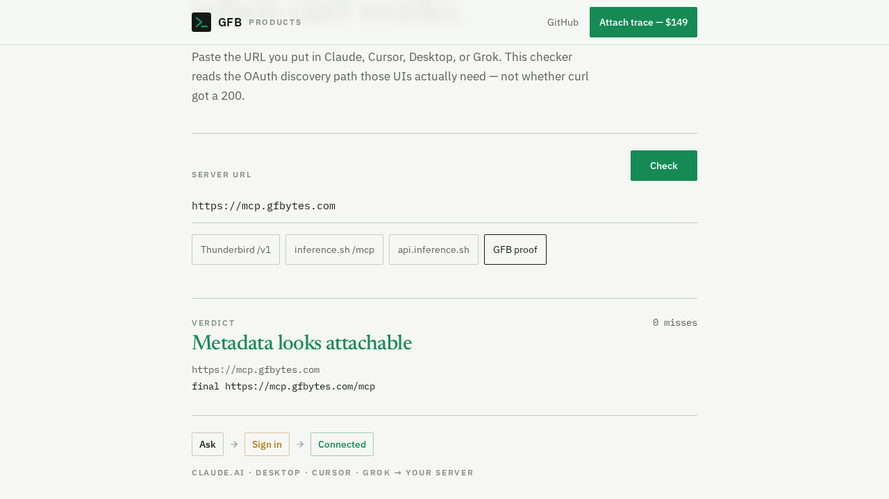
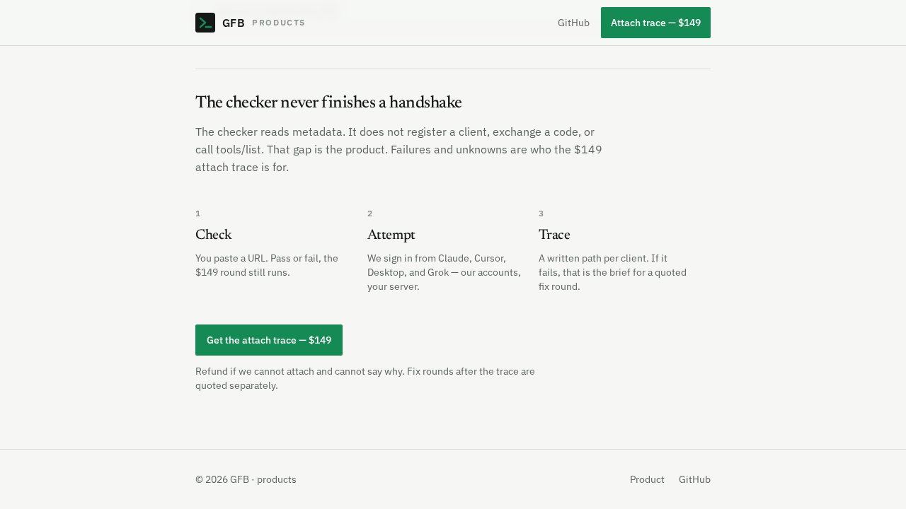

# MCP OAuth Connect — web checker

**Why Connectors fail when curl works.**

Paste the HTTPS MCP URL you put in Claude, Cursor, Desktop, or Grok. This app probes the OAuth discovery path those UIs actually need — not whether `curl` got a 200.

| | |
|---|---|
| **Product** | [gfbytes.com/products/mcp-oauth-connect](https://gfbytes.com/products/mcp-oauth-connect/) |
| **Free CLI / plugin** | [`GFB2026/mcp-oauth-connect`](https://github.com/GFB2026/mcp-oauth-connect) |
| **Demo MCP** | `https://mcp.gfbytes.com` |
| **Attach trace** | $149 — Stripe checkout on the product page |

This repo is the **web checker** (TanStack Start). The public skill repo is the free `diagnose.py` + marketplace install. Same probe semantics; this UI is the product surface.

## Screenshots





## Local

```bash
npm install
npm run dev          # http://0.0.0.0:8080
npm run typecheck
npm test
```

CLI diagnose (stdlib Python, no install):

```bash
python diagnose/diagnose.py https://mcp.gfbytes.com
cd diagnose && python -m pytest tests/
```

## What it checks

Authorization-server metadata (or OIDC fallback), PKCE S256, RFC 9728 protected-resource metadata (origin and path forms), no cross-host redirect on the MCP path, unauthenticated GET/POST behavior (401/405 vs anonymous discovery), absolute `resource_metadata` HTTPS URL.

## Repo layout

```
src/           web app (Checker UI + server diagnose)
diagnose/      CLI diagnose.py + tests (mirrors public skill)
screenshots/   product proof shots
scripts/       build / env helpers
server/        Nitro / PWA middleware
```

Build output (`.vercel/`, `dist/`) is gitignored — do not commit deploy artifacts.
